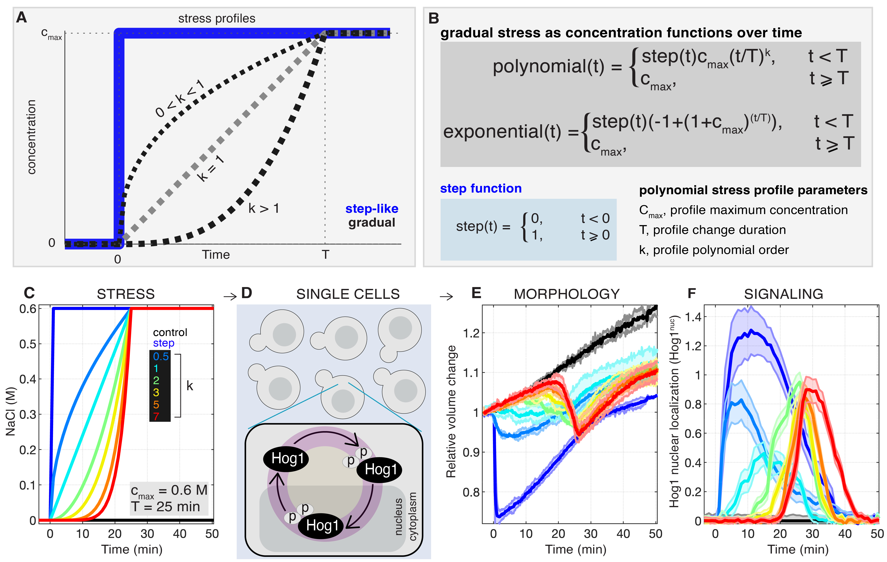

**Figure 3.** Distinct Responses to Gradual Stress in Single Cells.

**Figure S2.** Correction for Photobleaching of Hog1 Nuclear Localization Data.

The MATLAB codes for data analysis and plotting can be found in the `analysis-and-plots` directory.

