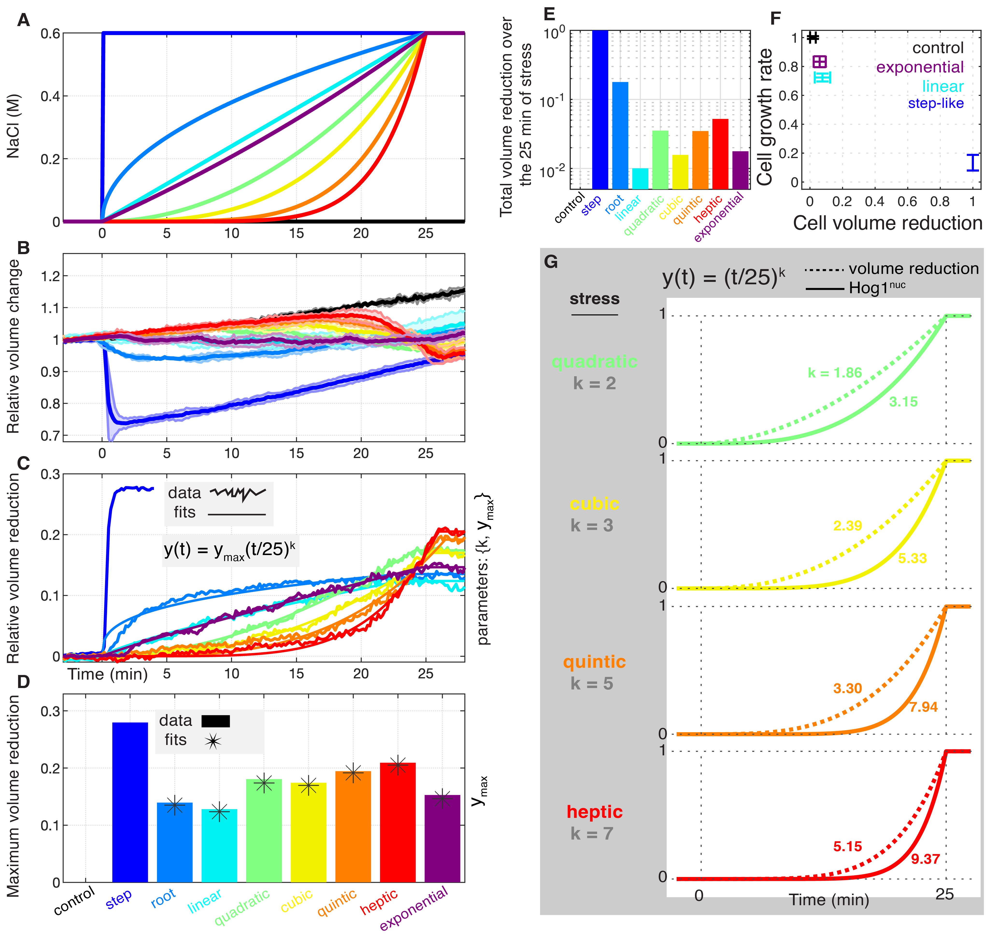

**Figure 4.** Dynamic Cellular Responses to Gradual NaCl Stress.

**Figure S3.** Dynamics of Cell Volume Reduction in Response to Gradual NaCl Stress.

**Figure S4.** Dynamics of Hog1 nuclear localization in Response to Gradual NaCl Stress.

The MATLAB codes for data analysis and plotting can be found in the `analysis-and-plots` directory.

