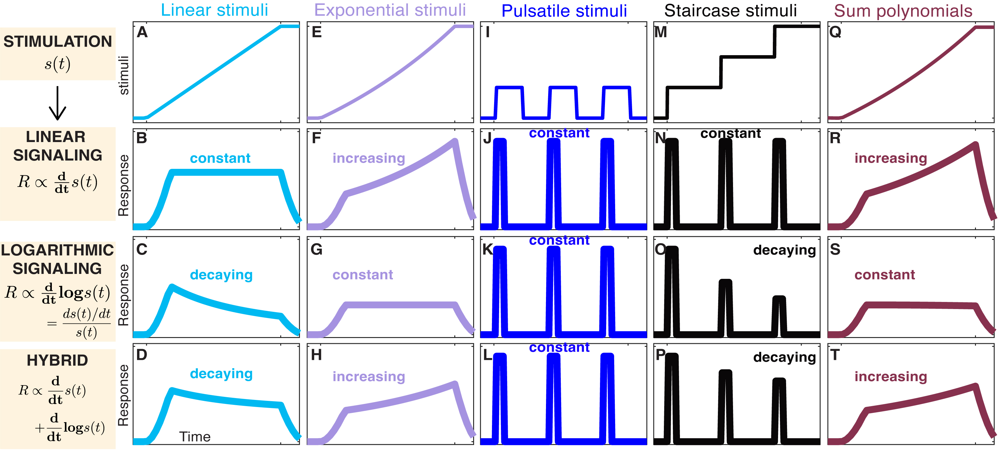

**Figure 5.** Different Signaling Models Convert Gradual Environmental Changes into Different Signaling Responses.

The MATLAB codes for analysis and plotting can be found in the `analysis-and-plots` directory.

