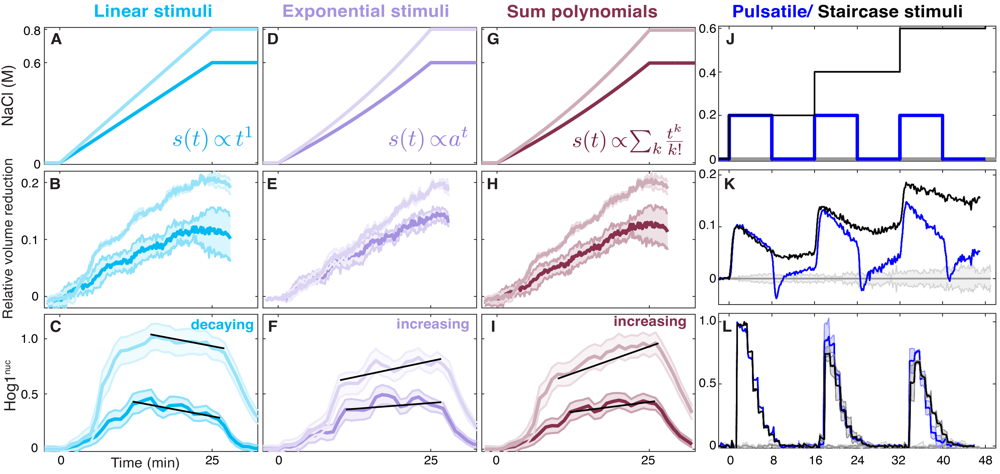

**Figure 6.** Verification of Logarithmic Signaling in the HOG Pathway through Gradual Cell Stress.

**Figure S5.** Responses to Pulsatile Versus Staircase Stress.

The MATLAB codes for data analysis and plotting can be found in the `analysis-and-plots` directory.

