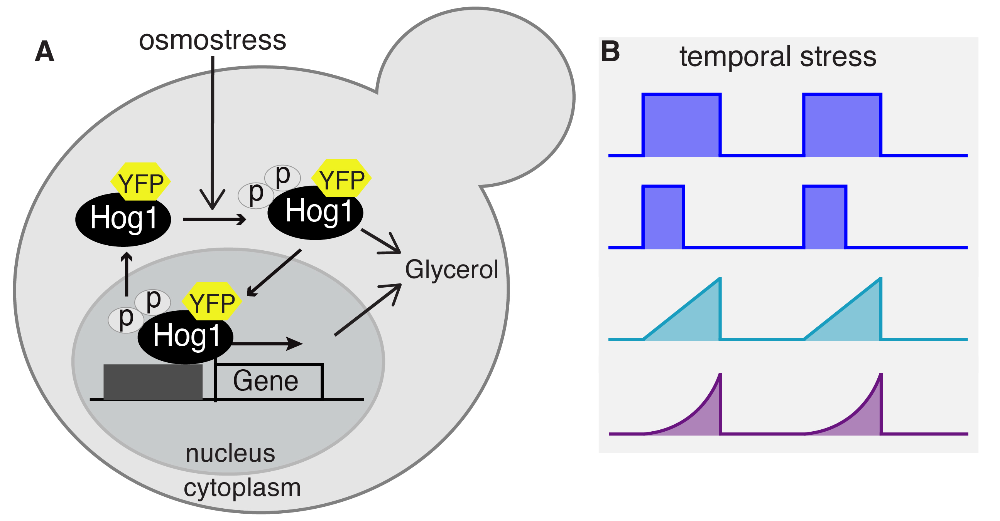

### Phenotypic Consequences of Logarithmic Signaling in MAPK Stress Response

**Authors:** Hossein Jashnsaz and Gregor Neuert

**Affiliations:** Department of Molecular Physiology and Biophysics, School of Medicine, Vanderbilt University, Nashville, TN 37232 USA

**Contact:** hjashnsaz@gmail.com, gregor.neuert@Vanderbilt.Edu  

**Summary**
How cells respond to dynamic environmental changes is crucial for understanding fundamental biological processes and cell physiology. In this study, we developed an experimental and quantitative analytical framework to explore how dynamic stress gradients that change over time regulate cellular volume, signaling activation, and growth phenotypes. Our findings reveal that gradual stress conditions substantially enhance cell growth compared to conventional acute stress. This growth advantage correlates with a minimal reduction in cell volume dependent on the dynamic of stress. We explain the growth phenotype with our finding of a logarithmic signal transduction mechanism in the yeast Mitogen-Activated Protein Kinase (MAPK) osmotic stress response pathway. These insights into the interplay between gradual environments, cell volume change, dynamic cell signaling, and growth, advance our understanding of fundamental cellular processes in gradual stress environments.

**Keywords**
 MAPK Hog1, Gradual Environments, Dynamic Cell Signaling, Cell Stress, Cell Volume, Cell Growth 

### Project Directories:

Directory: `data` contains the following: 
1. **cell-growth-data-OD600-measurements:**
   - yeast cell growth data using OD600 measurements under NaCl stress conditions.

2. **cell-stimulation-profiles:**
   - MATLAB codes to generate gradual stress profiles.
   - The generated PPL files for gradual stress profiles, suitable for programming syringe pumps.

3. **cell-volume-signaling-data:**
   - data for yeast cells volume change and Hog1 nuclear localization over time under gradual stress conditions.

4. **matlab-general-functions:**
   - general MATLAB functions crucial for running the codes in Figure02 to Figure06, facilitating data analysis and figure generation.

Directories `Figure01` to `Figure07` contains the corresponding figures and MATALB analysis codes. These codes are generated in MATLAB R2021a.

**Figure 1.** Dissecting Osmostress regulation of Volume Change, Cell Growth and Hog1 Signaling.

**Figure 2.** Enhanced Cell Growth under Gradual Osmotic Stress Compared to Acute Pulsatile Stress.

**Figure 3.** Distinct Responses to Gradual Stress in Single Cells.

**Figure 4.** Dynamic Cellular Responses to Gradual NaCl Stress.

**Figure 5.** Different Signaling Models Convert Gradual Environmental Changes into Different Signaling Responses.

**Figure 6.** Verification of Logarithmic Signaling in the HOG Pathway through Gradual Cell Stress.

**Figure 7.** Gradual Stress Identified Logarithmic Signaling as a Mechanism Contributing to Optimal Cell Growth.

