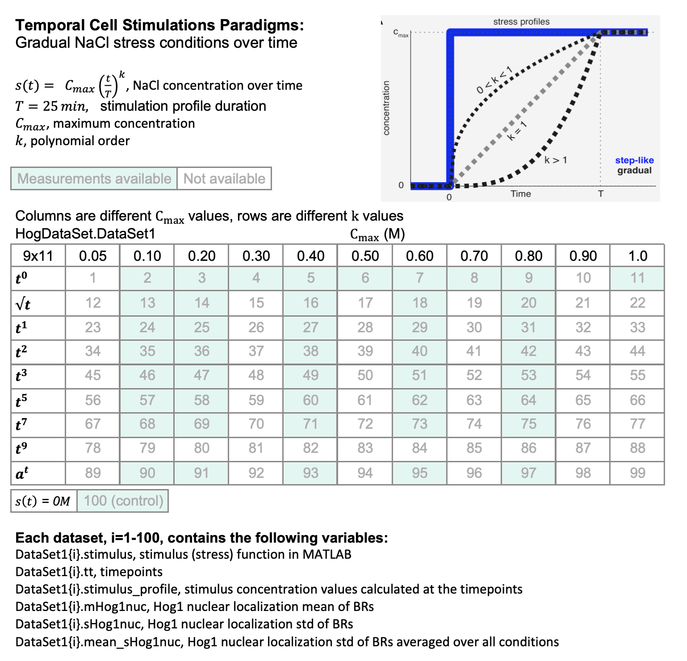

**HogDataSet.mat** is a MATLAB data structure containing signaling data from experiments for Hog1 nuclear localization. 

**Hog1SignalingData2.mat** is a MATLAB data structure containing cell volume and signaling data from experiments. 

The MATLAB codes for data analysis and plotting can be found in the `analysis-and-plots` directory in Figure02 to Figure06.

